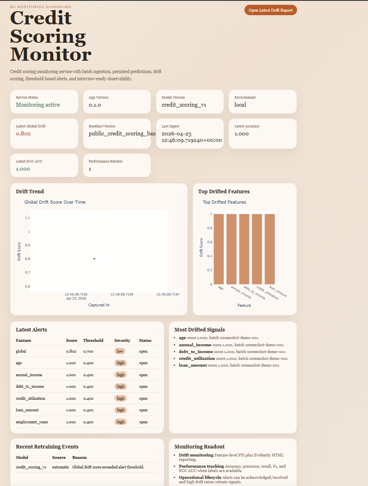
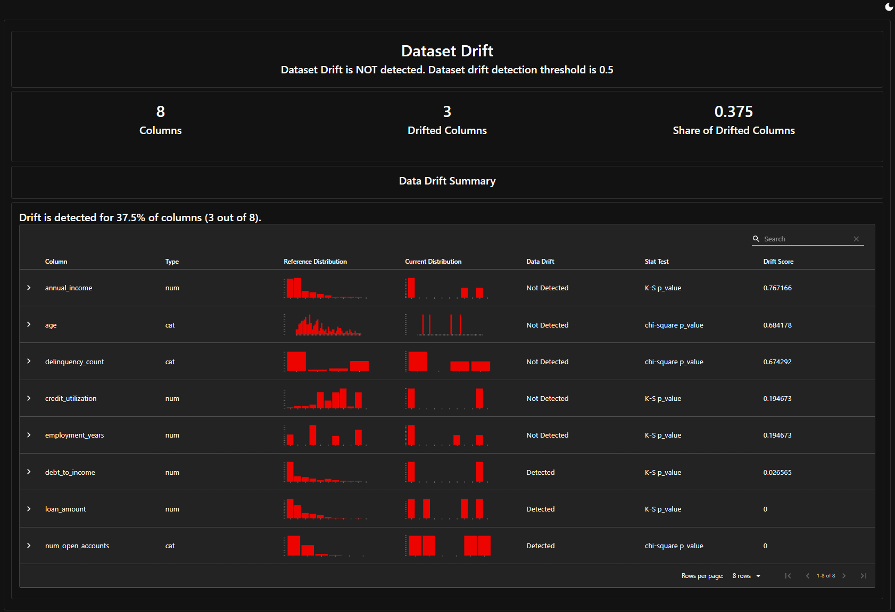

# Data Monitor

Production-like ML monitoring service for a **credit scoring** use case.

The service accepts batches of loan applications, scores default risk with a saved scikit-learn model, stores predictions and monitoring metrics in PostgreSQL, checks data drift against a versioned baseline, generates Evidently reports, raises alerts, and shows the monitoring state on a dashboard.

## Screenshots





## English

### What This Project Shows

This project is built to demonstrate the monitoring layer around an ML model, not just a prediction endpoint.

It covers:

- batch ingestion through FastAPI;
- input validation and basic data quality checks;
- prediction logging;
- PostgreSQL storage with SQLAlchemy models and Alembic migrations;
- feature-level and global data drift monitoring;
- Evidently HTML drift reports;
- alert creation and alert lifecycle;
- versioned baseline management;
- model performance metrics when labels are available;
- retraining trigger records;
- dashboard for metric history and operational status;
- Docker Compose and GitHub Actions CI.

### Domain

The demo case is **credit scoring**. Each record represents a loan applicant.

Input features:

- `age`
- `annual_income`
- `debt_to_income`
- `credit_utilization`
- `num_open_accounts`
- `delinquency_count`
- `loan_amount`
- `employment_years`
- optional `actual_default` for performance monitoring

### Model and Data

The project uses a real scikit-learn artifact:

- training script: `scripts/train_credit_model.py`
- model artifact: `models/credit_scoring_model.joblib`
- runtime variable: `MODEL_PATH=models/credit_scoring_model.joblib`

The model is a `StandardScaler` + `LogisticRegression` pipeline trained on the prepared OpenML `credit-g` dataset. The current holdout ROC AUC is around `0.77`, which is realistic enough for a compact demo project.

If the model artifact is missing, the app falls back to a deterministic rule-based scorer. This keeps the service demo-safe, but the normal path uses the saved model artifact.

Data preparation:

```bash
python scripts/prepare_public_dataset.py
```

This creates:

- `data/public_credit_scoring_sample.csv`
- `data/public_credit_scoring_baseline.csv`

Sources:

- OpenML `credit-g`: `https://api.openml.org/d/31`
- scikit-learn `fetch_openml`: `https://scikit-learn.org/stable/modules/generated/sklearn.datasets.fetch_openml.html`

### Architecture

```text
JSON batch
  -> FastAPI route
  -> Pydantic validation
  -> data quality checks
  -> model scoring
  -> prediction logs
  -> active baseline loading
  -> PSI drift calculation
  -> Evidently report generation
  -> alerts and retraining trigger
  -> PostgreSQL
  -> dashboard and API history
```

Project structure:

```text
app/
  api/v1/routes/     FastAPI routes
  core/              settings, constants, logging
  db/                database session and model imports
  dashboard/         Jinja2 template and Plotly charts
  jobs/              APScheduler jobs
  models/            SQLAlchemy ORM models
  monitoring/        drift calculation and data quality checks
  schemas/           Pydantic request/response schemas
  services/          business logic
alembic/             database migrations
data/                demo and prepared public data
docs/                screenshots and architecture notes
models/              trained model artifact
scripts/             helper scripts
tests/               unit, service, and endpoint tests
```

### Database Tables

The schema is normalized around monitoring entities:

- `batches`
- `prediction_logs`
- `drift_reports`
- `feature_drift_metrics`
- `performance_metrics`
- `alerts`
- `baselines`
- `model_versions`
- `retraining_events`

### API

```text
GET    /                         Dashboard
GET    /health                   Service and database status
POST   /ingest                   Ingest a batch and run monitoring
GET    /alerts                   List alerts with filters
PATCH  /alerts/{alert_id}        Update alert status
GET    /metrics/history          Drift and performance history
GET    /drift/report             Latest Evidently HTML report
POST   /baseline/reinitialize    Create a new active baseline
POST   /retrain/trigger          Manually trigger retraining signal
GET    /retrain/events           Retraining trigger history
```

### Run Locally

```bash
cp .env.example .env
docker compose up --build
```

Open:

```text
http://localhost:8000
```

Useful pages:

- dashboard: `http://localhost:8000/`
- Swagger UI: `http://localhost:8000/docs`
- health: `http://localhost:8000/health`
- alerts: `http://localhost:8000/alerts`
- metrics history: `http://localhost:8000/metrics/history`
- latest drift report: `http://localhost:8000/drift/report`

### Run Without Docker

Start PostgreSQL separately, then:

```bash
python -m pip install -e .[dev]
alembic upgrade head
uvicorn app.main:app --reload
```

### Seed Demo History

To fill the dashboard with several batches and drift scenarios:

```bash
python scripts/seed_demo_history.py
```

The script sends a few batches to `/ingest`: some reference-like, some shifted. This makes the drift trend, alerts table, performance cards, and retraining events more useful during a live demo.

### Example Ingest Request

```json
{
  "batch_id": "demo-batch-001",
  "records": [
    {
      "customer_id": "cust-1001",
      "age": 29,
      "annual_income": 54000.0,
      "debt_to_income": 0.41,
      "credit_utilization": 0.57,
      "num_open_accounts": 4,
      "delinquency_count": 1,
      "loan_amount": 16000.0,
      "employment_years": 4.0,
      "actual_default": false
    }
  ]
}
```

### Baseline Management

The baseline is not hardcoded in Python. It is stored as a versioned artifact and registered in the `baselines` table.

Example request for `/baseline/reinitialize`:

```json
{
  "source_csv_path": "data/public_credit_scoring_baseline.csv",
  "name": "OpenML credit-g baseline"
}
```

Or initialize from the first rows of another CSV:

```json
{
  "dataset_path": "data/public_credit_scoring_sample.csv",
  "sample_size": 250,
  "name": "Bootstrap public baseline"
}
```

### Monitoring Logic

The service tracks two separate things:

- **Data drift**: distribution shift of incoming features compared with the active baseline.
- **Model performance**: accuracy, precision, recall, F1, ROC AUC, and positive rate when `actual_default` is provided.

Drift can be calculated before true labels arrive. Performance metrics require labels, so they are calculated only for batches that include `actual_default`.

Alerts are created when feature-level or global drift thresholds are exceeded. Alert statuses are:

- `open`
- `acknowledged`
- `resolved`

Strong drift also creates a retraining event and marks the active model as `retrain_required`.

### Configuration

Main environment variables:

- `DATABASE_URL`
- `APP_NAME`
- `APP_VERSION`
- `ENVIRONMENT`
- `LOG_LEVEL`
- `DRIFT_THRESHOLD`
- `FEATURE_DRIFT_THRESHOLD`
- `ALERT_THRESHOLD`
- `BASELINE_PATH`
- `MODEL_VERSION`
- `MODEL_PATH`
- `REPORTS_DIR`
- `TIMEZONE`
- `CORS_ORIGINS`

See `.env.example` for defaults.

### Tests and CI

Run locally:

```bash
ruff check .
ruff format --check .
pytest -q
alembic upgrade head --sql
docker compose config
```

GitHub Actions runs linting, formatting check, tests, Alembic SQL validation, and Docker image build.

### Deployment Notes

The Docker image starts through `scripts/start.sh`, which runs migrations before Uvicorn:

```bash
alembic upgrade head
uvicorn app.main:app --host 0.0.0.0 --port ${PORT:-8000}
```

The app is ready for Railway-like platforms with managed PostgreSQL. For a portfolio demo, the recommended path is local Docker Compose plus screenshots. A temporary public deployment can be started before interviews if needed.

## Русский

### Что это за проект

`Data Monitor` - production-like сервис мониторинга ML-модели для credit scoring.

Он принимает batch заявок на кредит, считает риск дефолта через сохранённый scikit-learn artifact, сохраняет predictions и monitoring metrics в PostgreSQL, сравнивает входные данные с baseline, строит Evidently report, создаёт alerts и показывает состояние системы на dashboard.

Проект сделан не как “ещё один prediction endpoint”, а как небольшой monitoring layer вокруг модели.

### Что здесь реализовано

- batch ingestion через FastAPI;
- валидация входных данных через Pydantic;
- базовые data quality checks;
- prediction logs;
- PostgreSQL + SQLAlchemy ORM;
- Alembic migrations;
- feature-level и global data drift;
- Evidently HTML reports;
- alerts с lifecycle `open` / `acknowledged` / `resolved`;
- versioned baseline management;
- model performance metrics, если в batch есть `actual_default`;
- retraining trigger;
- dashboard с историей drift, alerts и performance;
- Docker Compose;
- GitHub Actions CI.

### Домен

Демо-кейс - **credit scoring**. Каждая запись - это заявка клиента на кредит.

Признаки:

- `age`
- `annual_income`
- `debt_to_income`
- `credit_utilization`
- `num_open_accounts`
- `delinquency_count`
- `loan_amount`
- `employment_years`
- optional `actual_default` для performance monitoring

### Модель и данные

В проекте используется настоящий scikit-learn artifact:

- training script: `scripts/train_credit_model.py`
- model artifact: `models/credit_scoring_model.joblib`
- runtime variable: `MODEL_PATH=models/credit_scoring_model.joblib`

Модель - это pipeline `StandardScaler` + `LogisticRegression`, обученный на подготовленном OpenML `credit-g`. Holdout ROC AUC около `0.77`. Для компактного demo это нормальный и честный результат.

Если artifact отсутствует, сервис использует deterministic fallback scorer. Это нужно, чтобы демо не ломалось в новой среде, но основной сценарий работает через сохранённую модель.

Подготовка публичного датасета:

```bash
python scripts/prepare_public_dataset.py
```

Скрипт создаёт:

- `data/public_credit_scoring_sample.csv`
- `data/public_credit_scoring_baseline.csv`

Источники:

- OpenML `credit-g`: `https://api.openml.org/d/31`
- scikit-learn `fetch_openml`: `https://scikit-learn.org/stable/modules/generated/sklearn.datasets.fetch_openml.html`

### Архитектура

```text
JSON batch
  -> FastAPI route
  -> Pydantic validation
  -> data quality checks
  -> model scoring
  -> prediction logs
  -> active baseline loading
  -> PSI drift calculation
  -> Evidently report generation
  -> alerts and retraining trigger
  -> PostgreSQL
  -> dashboard and API history
```

Структура проекта:

```text
app/
  api/v1/routes/     FastAPI routes
  core/              settings, constants, logging
  db/                database session and model imports
  dashboard/         Jinja2 template and Plotly charts
  jobs/              APScheduler jobs
  models/            SQLAlchemy ORM models
  monitoring/        drift calculation and data quality checks
  schemas/           Pydantic request/response schemas
  services/          business logic
alembic/             database migrations
data/                demo and prepared public data
docs/                screenshots and architecture notes
models/              trained model artifact
scripts/             helper scripts
tests/               unit, service, and endpoint tests
```

### Таблицы БД

- `batches`
- `prediction_logs`
- `drift_reports`
- `feature_drift_metrics`
- `performance_metrics`
- `alerts`
- `baselines`
- `model_versions`
- `retraining_events`

Схема не сведена в одну плоскую таблицу. Сущности мониторинга разделены, поэтому их удобно фильтровать, анализировать и показывать на dashboard.

### API

```text
GET    /                         Dashboard
GET    /health                   Статус сервиса и БД
POST   /ingest                   Загрузка batch и запуск monitoring
GET    /alerts                   Список alerts
PATCH  /alerts/{alert_id}        Обновление статуса alert
GET    /metrics/history          История drift и performance metrics
GET    /drift/report             Последний Evidently HTML report
POST   /baseline/reinitialize    Создание нового active baseline
POST   /retrain/trigger          Ручной retraining signal
GET    /retrain/events           История retraining triggers
```

### Локальный запуск

```bash
cp .env.example .env
docker compose up --build
```

Открыть:

```text
http://localhost:8000
```

Полезные страницы:

- dashboard: `http://localhost:8000/`
- Swagger UI: `http://localhost:8000/docs`
- health: `http://localhost:8000/health`
- alerts: `http://localhost:8000/alerts`
- metrics history: `http://localhost:8000/metrics/history`
- latest drift report: `http://localhost:8000/drift/report`

### Запуск без Docker

Сначала нужно отдельно поднять PostgreSQL, затем:

```bash
python -m pip install -e .[dev]
alembic upgrade head
uvicorn app.main:app --reload
```

### Наполнить dashboard демо-историей

```bash
python scripts/seed_demo_history.py
```

Скрипт отправляет несколько batch в `/ingest`: часть похожа на baseline, часть содержит drift. После этого dashboard выглядит живее: появляются drift trend, alerts, performance metrics и retraining events.

### Пример ingest request

```json
{
  "batch_id": "demo-batch-001",
  "records": [
    {
      "customer_id": "cust-1001",
      "age": 29,
      "annual_income": 54000.0,
      "debt_to_income": 0.41,
      "credit_utilization": 0.57,
      "num_open_accounts": 4,
      "delinquency_count": 1,
      "loan_amount": 16000.0,
      "employment_years": 4.0,
      "actual_default": false
    }
  ]
}
```

### Baseline management

Baseline не захардкожен в Python. Он хранится как versioned artifact и регистрируется в таблице `baselines`.

Пример запроса на `/baseline/reinitialize`:

```json
{
  "source_csv_path": "data/public_credit_scoring_baseline.csv",
  "name": "OpenML credit-g baseline"
}
```

Или baseline из первых строк другого CSV:

```json
{
  "dataset_path": "data/public_credit_scoring_sample.csv",
  "sample_size": 250,
  "name": "Bootstrap public baseline"
}
```

### Monitoring logic

Сервис отслеживает две разные вещи:

- **Data drift**: сдвиг распределений входных признаков относительно active baseline.
- **Model performance**: accuracy, precision, recall, F1, ROC AUC и positive rate, если в batch передан `actual_default`.

Drift можно считать до появления true labels. Performance metrics можно считать только после появления фактического target.

Alerts создаются, если превышены feature-level или global thresholds. Статусы alerts:

- `open`
- `acknowledged`
- `resolved`

Сильный drift также создаёт retraining event и помечает active model как `retrain_required`.

### Configuration

Основные environment variables:

- `DATABASE_URL`
- `APP_NAME`
- `APP_VERSION`
- `ENVIRONMENT`
- `LOG_LEVEL`
- `DRIFT_THRESHOLD`
- `FEATURE_DRIFT_THRESHOLD`
- `ALERT_THRESHOLD`
- `BASELINE_PATH`
- `MODEL_VERSION`
- `MODEL_PATH`
- `REPORTS_DIR`
- `TIMEZONE`
- `CORS_ORIGINS`

Значения по умолчанию есть в `.env.example`.

### Tests and CI

Локальная проверка:

```bash
ruff check .
ruff format --check .
pytest -q
alembic upgrade head --sql
docker compose config
```

GitHub Actions запускает lint, format check, tests, Alembic SQL validation и Docker image build.

### Deployment notes

Docker image стартует через `scripts/start.sh`: сначала применяются миграции, затем запускается Uvicorn.

```bash
alembic upgrade head
uvicorn app.main:app --host 0.0.0.0 --port ${PORT:-8000}
```

Проект готов к деплою на Railway-like платформы с managed PostgreSQL. Для портфолио основной сценарий - локальная Docker Compose демонстрация плюс скриншоты; временный public deploy можно поднять перед собеседованием.
